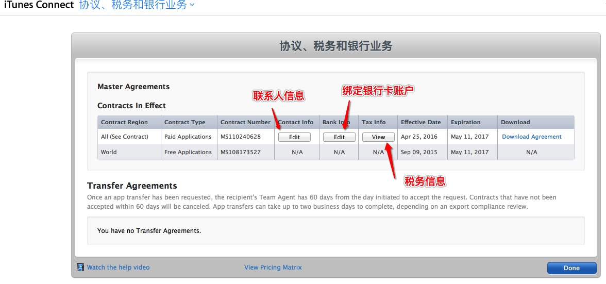

#应用内购买(虚拟物品篇)
####为什么要使用应用内购买
* 只要你的iOS应用内涉及到虚拟的产品和服务,必须要使用苹果的应用内购买,否则一经查出不予上架或从App Store立即下架
* 苹果会从应用内购买项目付费产品中抽取30%的提成,余下的70%才是开发者得到的实际收入

####应用内购买(虚拟物品)
* 登录[苹果开发者账号](https://developer.apple.com/account) , 选择进入 iTunes Connect

* 首先进入 协议税务和银行业务,填写相关信息(可直接向负责人索要)

* 完善协议银行信息之后,选择进入我的App

* 新建一个APP,套装ID选择在Certificates, Identifiers & Profiles中相对应的APP ID

* 选中你新建的App,来到功能模块的APP内购买项目

* 选择你的应用内购买产品类型

* 只需按照要求填写相关信息即可

* 完成需要内购项目的创建

* 此时需要添加一个测试账户用来测试购买你的内购项目,来到用户职能模块

* 选择沙箱技术测试员,添加测试员账户

* 忘记了测试员账号密码也没关系,可以删除重新新建,或者选择添加多个测试员

* 添加测试员成功,至此 在iTunes Connect 上构建应用内购买项目完毕,接下来需要[代码]()与之相呼应 

