# 手动打包分发测试应用(蒲公英为例)
#### 配置Xcode
* 选择开发环境

* 设备选择 Generic iOS Device
 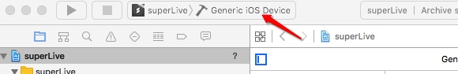

#### 打包
* 选择Xcode 中 Product 选项 进行 Archive
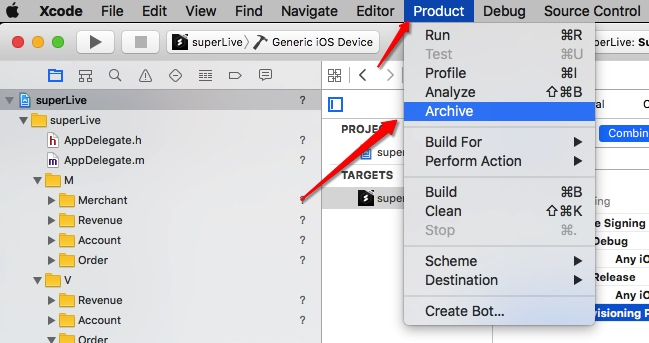
* 打包完成,选择在Finder中显示
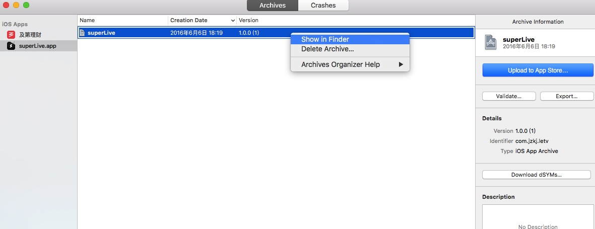
#### 将 .archive 转成 .ipa 文件
* 选择 xxx.archive 文件,显示包内容
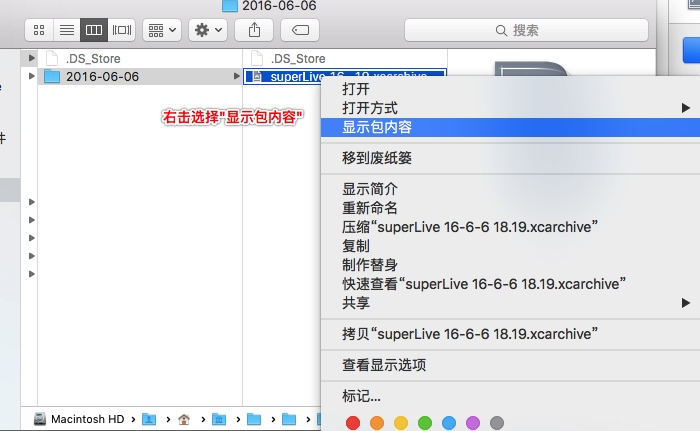

* 找到Products/Applications目录下的 xxx.app 文件
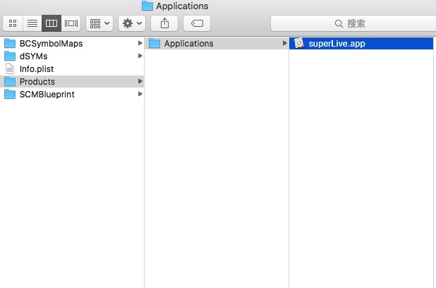

* 打开 iTunes ,选择 应用 模块
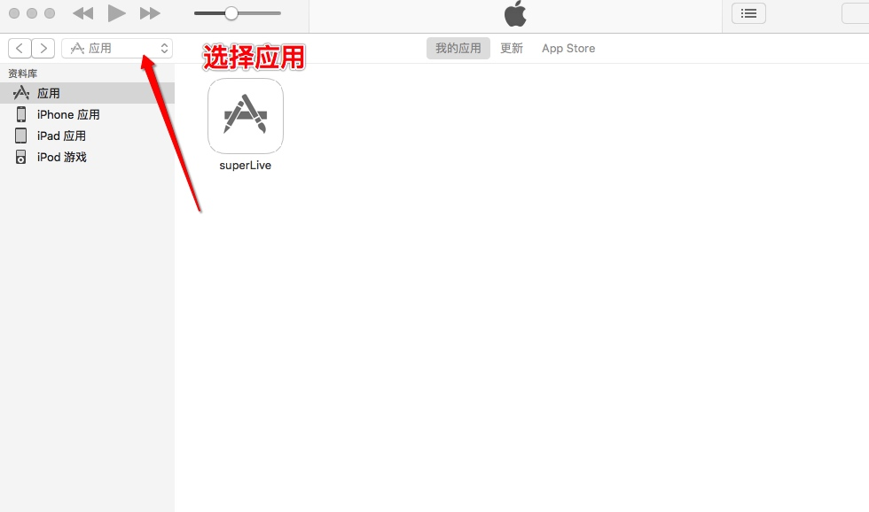
* 将 刚才生成的 xxx.app 文件拖入到 iTunes 中
 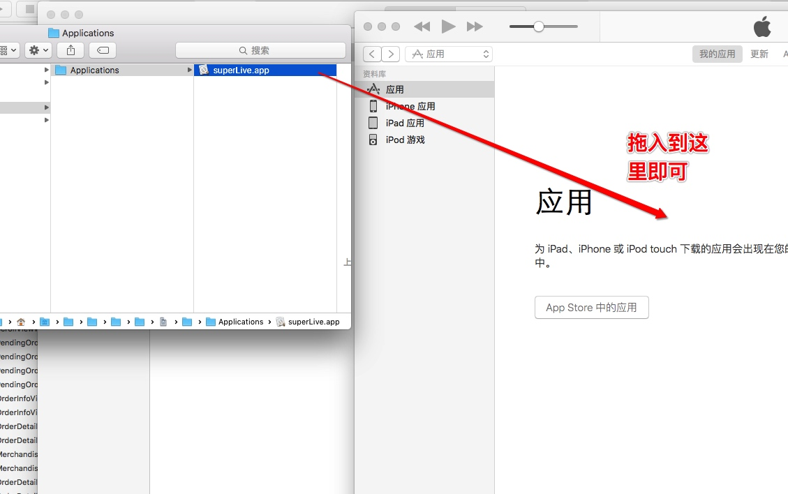
 
* 选择iTunes中的应用,Finder中显示
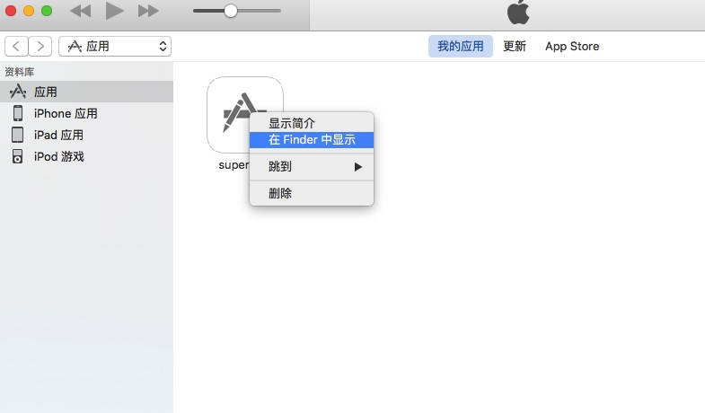
* 找到最终生成可发布测试的 xxx.ipa 文件
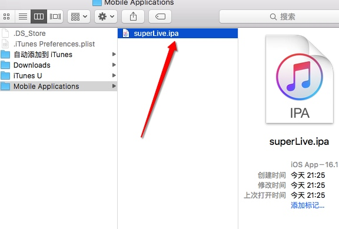
#### [蒲公英应用测试平台](https://www.pgyer.com)
* 注册蒲公英账号,直接选择上传应用

* 按照要求上传完应用,直接发布
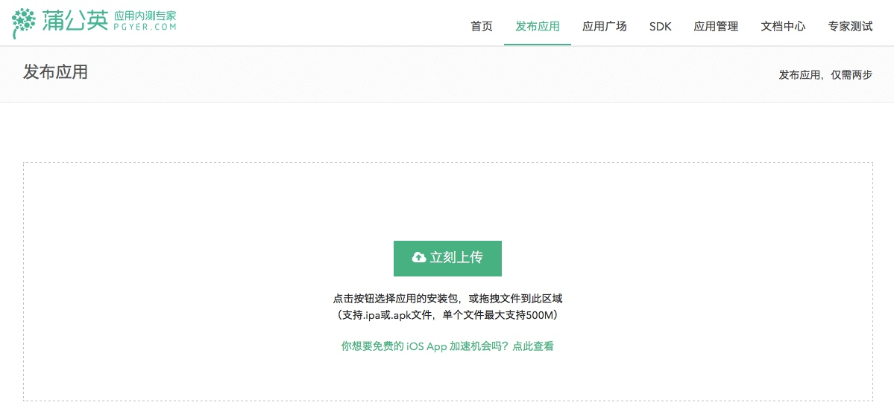

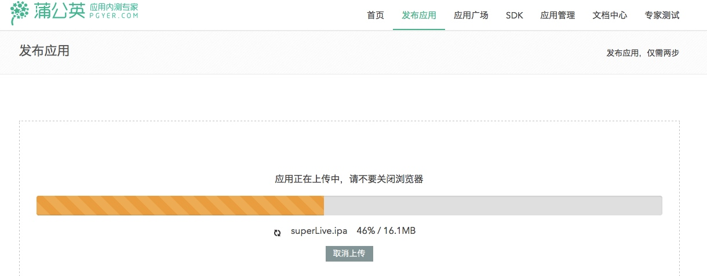

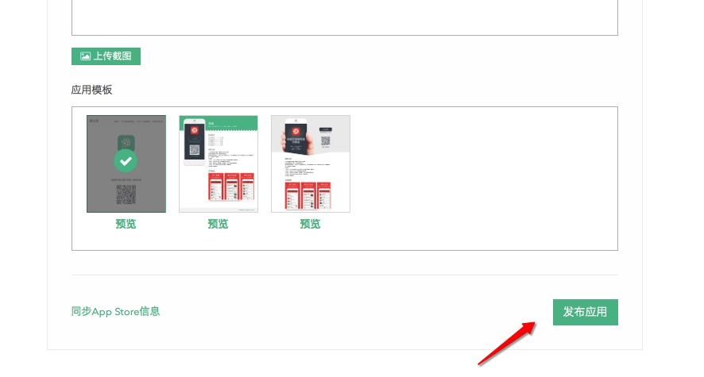

* ,生成可扫描安装的二维码,至此在蒲公英内侧平台分发测试应用成功
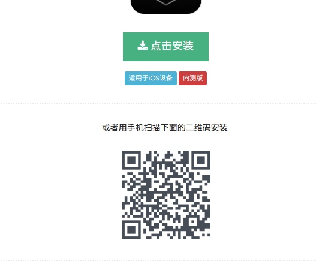

