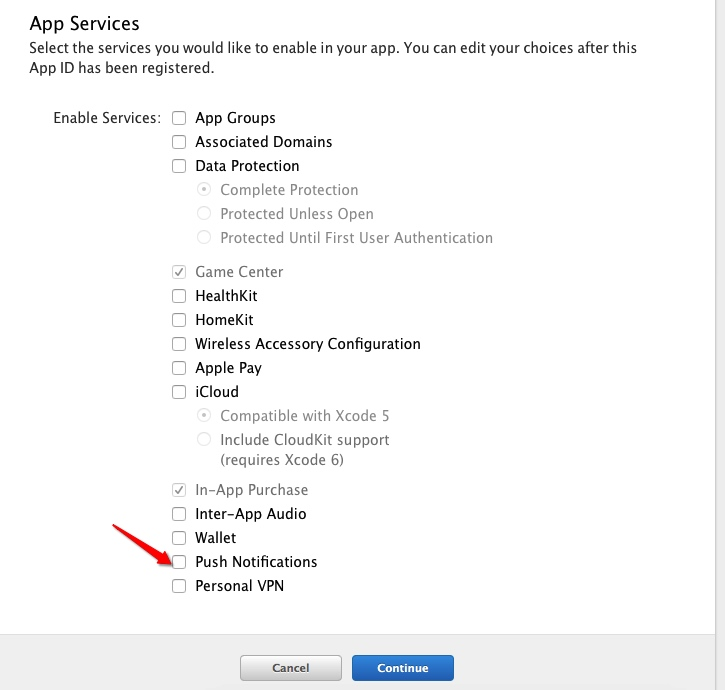
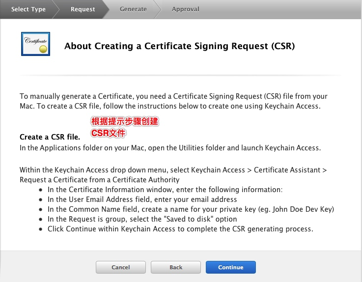

# 极光推送(证书篇)
####为 App 添加推送功能
#####来到 App IDs 模块
1.登录[苹果开发者](https://developer.apple.com),选择进入Certificates, Identifiers & Profiles

2.在 [Certificates, Identifiers & Profiles](https://developer.apple.com/account/ios/certificate)中，点击App IDs进入App ID列表

3.新建 App ID,根据实际情况完善 App ID 信息并提交,注意此处需要指定具体的 Bundle ID 不要使用通配符。

4.为 App 开启 Push Notification 功能,如果 ID 已经存在则可以直接跳过创建直接编辑选中开启 Push Notifications 功能即可

####配置下载推送证书
#####来到Certificates(证书)模块
* 如果你之前没有创建过 Push 证书或者是要重新创建一个新的，请在证书列表下面新建
	

* 新建证书需要注意选择证书种类,本文只集成开发证书（开发证书用于开发和调试使用，生产证书用于 App Store 发布）
	

* 点击 Continue 后选择证书对应的应用ID，然后继续会出现“About Creating a Certificate Signing Request (CSR)” 

* 此时回到mac应用程序中打开钥匙串访问应用

* 填写“用户邮件地址”和“常用名” 后选择 存储到磁盘 进行保存 (邮箱地址和常用名可随意填写)

*	继续返回Apple developer 网站点击 Continue ，上传刚刚在钥匙串访问应用中生成的 .certSigningRequest 文件生成 APNs Push Certificate
*	下载并双击打开证书，证书打开时会启动“钥匙串访问”工具
*	在“钥匙串访问”中你的证书会显示在“我的证书”中，注意选择“我的证书” 和"登录"
	
*  将文件保存为个人信息交换 (.p12)格式
	

####上传上述新建的证书
#####来到 Provisioning Profiles 模块
* 创建Provisioning Profile,然后选择要创建Provisioning Profile的App ID后点击[Continue]

* 为该Provisioning Profile选择将要安装的设备（一般选择[Select All]），点击[Continue]

* 填写完Profile Name后点击[generate]完成创建，之后点击[DownLoad]下载Provisioning Profile

#####[请参考极光推送官方文档](http://docs.jpush.io/client/ios_tutorials/#_7)

